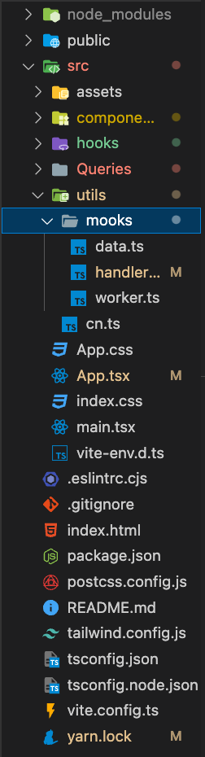

# msw를 찾기 까지의 여정

저는 프론트엔드 개발을 위주로 하고 있습니다.

그리고 제가 지금까지 팀프로젝트를 하던 순서는 간단하게

1. 프로젝트 아이디어 선정
2. 선정 된 주제에 필요한 기능에 대하여 정리
3. Figma로 프로토타입 만들기
4. 퍼블리싱
5. 기능구현

이 정도로 볼수가 있는데,

이게 현업에서는 이런 과정으로 작업하는 경우도 물론 있겠지만

기존에 서버의 api는 어느정도 구현이 되어 있고 데이터 먼저 받아서 확인을 한 후에 퍼블리싱을 하는 경우가 더 많다고 하더군요 ?

구름 과정 중 멘토링에서 들은 이야기 였습니다.

그래서 그런 방식을 미리 체험해보고 싶기도 했고 퍼블리싱을 해놓고 그에 따라 오는 데이터를 어느정도 예상해서 화면을 구상할수도 있겠지만

가져오는 데이터가 확실해지고 통신에 대한 로직을 먼저 만들어 놓으면 퍼블리싱이 더 수월해질것 같다는 생각도 들더군요 ?

그래서 여러가지 방안을 찾아봤습니다.

## 그냥 파일 만들기

단순하게 로컬환경에서 `data.js` 이런식으로 파일을 만들어서 사용하는 방법이고
API가 미완성일때 저는 이 방법을 주로 사용해서 임시로 데이터를 받아와서 뷰에 보여주곤 했었습니다.

### 장점

- 간단하다.

### 단점

- api설계를 할수 없다.
- 관련 로직을 분리하기가 어렵다.

이정도 특징이 있겠습니다..! 뭐 아주 간단하죠

## 가짜 서버 만들기

json 파일로 데이터 송수신에 도움을 주는 가짜 서버를 만들수 있는 라이브러리가 있습니다.

`npm install -g json-server`
`yarn add -g json-server`

라이브러리를 설치하여 사용할수 있고

https://velog.io/@xxoixo/%EA%B0%80%EC%A7%9C-%EC%84%9C%EB%B2%84json-server-%EC%82%AC%EC%9A%A9%ED%95%98%EA%B8%B0

세팅법을 여기서 확인해보실수 있습니다.

사실 이건 한번밖에 안써봤으나 msw보단 간단하고 mock파일을 만드는것 보다는 복잡하지만 이것도 임시적으로 괜찮은 환경을 제공했던 것으로 기억합니다!

## msw

다음으로는 오늘 포스팅의 주인공인 msw라는 라이브러리입니다.

셋팅을 한번 해놓으면 추가기능을 만들때에도 간단한 api에 대한 정보만 있다면 간단하게 테스트해보기도 좋고 개발 시작 단계에서도 미리 셋팅 한번 해놓으면 생산성이 아주 좋아진답니다.

사용법부터 실제 사례까지 한번 같이 보겠습니다!

### msw 셋팅

`yarn add -D msw`

개발환경에서만 사용할 것이기 때문에 -D옵션을 추가해줍니다.

여기서 제가 글을 쓰게된 이유 중에서 가장 중요한 부분이 나오는데요..

`yarn add msw@0.29.0 -D`

msw의 최신버전은 2.0.13 버전일텐데 저는 버전을 이렇게 극단적으로 낮춰야만 정상적으로 작동 하더군요.

서칭하다 보니 같은 에러를 보이는 분들을 많이 찾을수 있었고 msw로 모킹작업을 너무 하고싶었던 저는 이렇게 해결 방법을 찾을수 있었답니다 ..

이렇게 라이브러리를 다운로드한 후에는

` npx msw init public/ --save`

msw init을 진행해줍니다.

public폴더에 파일이 이렇게 생긴것이 확인 되었다면 설치는 여기까지 !

최신버전과 셋팅방법이 약간은 다를수 있지만 거의 유사하고 다른 글에서도 최신버전에 대한 셋팅은 많기 때문에 제 환경을 기준으로 다음 셋팅을 이어가 보겠습니다.

저의 경우에는 Vite + React + TS 프로젝트에서 테스트를 진행했고,

src/utils/mooks 경로에 파일을 넣어주었습니다.



필요한 파일은 3개 입니다.

- `data.ts` 데이터를 넣어줄 파일입니다.
- `handler.ts` 요청에 대한 로직을 작성해줄 파일입니다.
- `worker.ts` 음.. 단순히 셋팅파일 입니다!

`data.ts`

```javascript
export const todos: string[] = ['할일1', '할일2', '할일3'];
```

`handler.ts`

```javascript
import { todos } from './data';
import { rest } from 'msw';

export const handlers = [
  //get요청에 대한 로직
  rest.get('/todos', async (_, res, ctx) => {
    console.log(todos);
    return await res(ctx.status(200), ctx.json(todos));
  }),
  //post요청에 대한 로직
  rest.post('/todo', async (req, res, ctx) => {
    const data = req.body?.toString();
    if (data !== undefined) {
      todos.push(data);
    }
    return await res(ctx.status(201), ctx.json(todos));
  }),
];
```

`worker.ts`

```javascript
import { setupWorker } from 'msw';
import { handlers } from './handlers.ts';

export const worker = setupWorker(...handlers);
```

이정도로 작성해주신 후에

`main.tsx` or `index.tsx`

```javascript
import ReactDOM from 'react-dom/client';
import App from './App.tsx';
import './index.css';
import { worker } from './utils/mooks/worker';

//개발환경에서 worker를 import해와서 동작시킴
if (process.env.NODE_ENV === 'development') {
  worker.start();
}

ReactDOM.createRoot(document.getElementById('root')!).render(
  <App />
);
```

여기까지하면 셋팅 끝이고 브라우저의 콘솔에서 이런 이미지를 확인할수 있습니다.


이제 간단한 get요청을 통해 todos를 불러와볼까요 !

뭐 fetch와 같은 함수를 사용할수도 있겠지만 axios를 사용해서 요청해볼게요.

### get

`handler.ts`

```javascript
import { todos } from './data';
import { rest } from 'msw';

export const handlers = [
  rest.get('/todos', async (_, res, ctx) => {
    return await res(ctx.status(200), ctx.json(todos));
  }),
];
```

api 작업을 해줍니다.

handlers 배열 내부에 `rest.{method}`를 작성해주고 엔드포인트 지정과 로직을 작성해줍니다.

위 코드의 경우에는 간단하게 요청이 들어오면 200 상태코드와 todos를 json형식으로 반환 해주고 있습니다.

express.js로 작업하는것과 매우 유사하고 간단합니다.

`App.js`

```javascript
  const [todos, setTodos] = React.useState<string[]>([]);

  const getTodo = async () => {
    try {
      const result = await axios.get('todos');
      setTodos(result.data);
    } catch (error) {
      console.log(error);
    }
  };

  React.useEffect(() => {
  getTodo();
  }, []);

  return(
    <>
      {todos.map((el, i) => (
      <div key={i}>{el}</div>
      ))}
    </>
  )
```

`useEffect`로 최초 진입 시 todo를 불러옵니다.

`data.ts`

```javascript
export const todos: string[] = ['공부', '밥먹기', '잠자기'];
```

그리고 데이터는 이런 형식으로 되어있죠 !

뷰는 이렇게 확인할수 있습니다.


`get`요청을 이렇게 테스트해봤습니다.

### post

같은 순서로 설명해보겠습니다.

`handlers.ts`

```javascript
import { todos } from './data';
import { rest } from 'msw';

export const handlers = [
  rest.post('/todo', async (req, res, ctx) => {
    const data = req.body?.toString();
    if (data !== undefined) {
      todos.push(data);
    }
    console.log('todos : ', todos);
    return await res(ctx.status(201), ctx.json(todos));
  }),
];
```

클라이언트에서 받아온 데이터를 todos배열에 추가해주고 성공한다면
201 상태코드와 추가된 상태의 todos배열을 반환해주는 로직을 작성했습니다.

만약 자바스크립트라면

```javascript
const data = req.body?.toString();
if (data !== undefined) {
  todos.push(data);
}
```

이 코드를

```javascript
const data = req.body;
todos.push(data);
```

이렇게만 수정해주면 될겁니다.

`App.tsx`

```javascript
import axios from 'axios';
import './App.css';
import Button from './components/atom-components/Button';

import React from 'react';
const App = () => {
  const [todos, setTodos] = React.useState<string[]>([]);
  const [value, setValue] = React.useState<string>('');
  const setTodo = async (todo: string) => {
    try {
      const result = await axios.post('todo', todo);
      setTodos(result.data);
      setValue('');
    } catch (error) {
      console.log(error);
    }
  };

  return (
    <div className='w-screen h-screen flex items-center justify-center flex-col gap-3'>
      <input
        className='border'
        type='text'
        value={value}
        onChange={(e) => {
          setValue(e.target.value);
        }}
      />
      <Button
        onClick={() => {
          setTodo(value);
        }}
        label='버튼'
      />
    </div>
  );
};

export default App;

```

클라이언트에선 인풋에 담긴 값을 서버에 보내주는 작업입니다!

이 작업을 완료하면 투두목록의 상태가 업데이트되고 화면에도 보여지면서,
msw 서버에서는 추가된 투두배열을 보여줄것 입니다 !


이렇게 서버 측에서도 그리고 받아와서 보여주는 클라이언트 측에서도 잘동작합니다.

동작 테스트는 여기까지 해보겠습니다 !

### 전체 코드

`handler.ts`

```javascript
import { todos } from './data';
import { rest } from 'msw';

export const handlers = [
  rest.get('/todos', async (_, res, ctx) => {
    return await res(ctx.status(200), ctx.json(todos));
  }),

  rest.post('/todo', async (req, res, ctx) => {
    const data = req.body?.toString();
    if (data !== undefined) {
      todos.push(data);
    }
    console.log('todos : ', todos);
    return await res(ctx.status(201), ctx.json(todos));
  }),
];
```

`App.tsx`

```javascript
import axios from 'axios';
import './App.css';
import Button from './components/atom-components/Button';

import React from 'react';
const App = () => {
  const [todos, setTodos] = React.useState<string[]>([]);
  const [value, setValue] = React.useState<string>('');
  const getTodo = async () => {
    try {
      const result = await axios.get('todos');
      setTodos(result.data);
    } catch (error) {
      console.log(error);
    }
  };

  const setTodo = async (todo: string) => {
    try {
      const result = await axios.post('todo', todo);
      setTodos(result.data);
      setValue('');
    } catch (error) {
      console.log(error);
    }
  };

  React.useEffect(() => {
    getTodo();
  }, []);
  return (
    <div className='w-screen h-screen flex items-center justify-center flex-col gap-3'>
      <div className=' flex items-center justify-center bg-red-300 p-2 rounded-md'>할 일 목록</div>
      {todos.map((el, i) => (
        <div key={i}>{el}</div>
      ))}
      <input
        className='border'
        type='text'
        value={value}
        onChange={(e) => {
          setValue(e.target.value);
        }}
        onKeyDown={(e) => {
          if (e.nativeEvent.isComposing) {
            return;
          }
          if (e.key === 'Enter') {
            e.preventDefault();
            setTodo(value);
          }
        }}
      />
      <Button
        onClick={() => {
          setTodo(value);
        }}
        label='버튼'
      />
    </div>
  );
};

export default App;
```

### 이거 뭐가 좋음?

이렇게 혼자 하다보니까 정확히 쓸모있는건가 ? 싶기는 한데 프로젝트에 들어가고 구현해야 하는 기술이 어느정도 정의가 되어있다면 즉시 데이터 송수신 작업을 들어갈수 있다는 것이 가장 큰 장점이라고 생각해요 !

규모가 커질수록 더 가치있다고 느껴지고,

셋팅도 사실 거의 복붙이라 저는 혼자하는 프로젝트가 아닌 백엔드와의 협업이 필요한 프로젝트라면 필수로 셋팅하는 편입니다.

초기보단 추 후에 기능추가할 때 더 빛을 발한답니다!

express 공부 하는 기분이 드는건 덤입니다. ~~개꿀이죠ㅎㅎ~~

협업 외에도 서버 로직과 클라이언트 로직을 분리하는 연습을 하고싶다면

React-query를 혼자 학습해보고싶다면

그리고 언젠가 풀스택으로 만들 프로젝트인데 아직 서버쪽 구성할 준비가 되어있지 않아서 임시로 가짜서버를 구성해보고싶다면

등등

다양한 방법으로 사용해볼수 있겠습니다 !

그럼 너무 유용하고 많은분들이 사용하시는 msw에 대한 이야기 여기까지 해보겠습니다.

혹시 msw 연동이 안된다면 버전을 한번 유의해보십쇼 .. !
