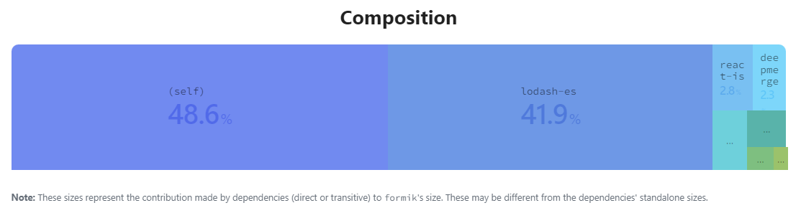
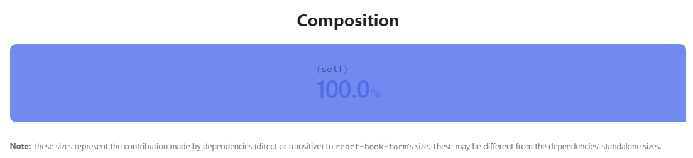
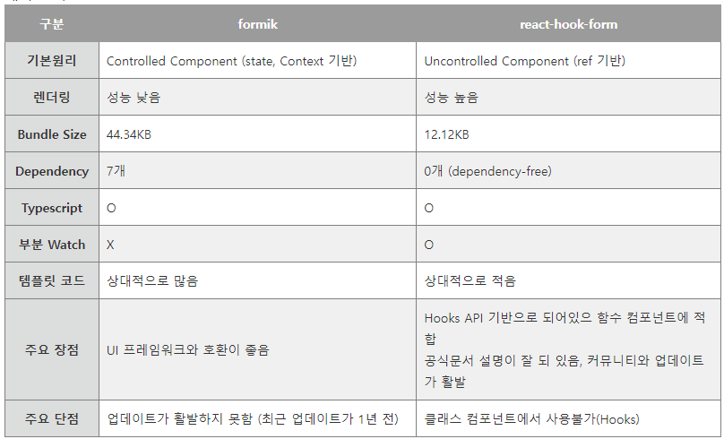
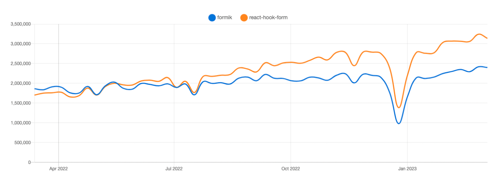

# Formik vs React-hook-form

# 리액트에서 Form 사용하기

- 리액트는 form을 사용할 때 form의 input value를 `setState()`로 관리해서 개발할 때 직접 form data를 제어하는 방식을 권장함 → Controlled Component라고 함
  - Controlled Component: 사용자가 input 값을 변경할 때마다 form도 업데이트되고, value는 state에 저장됨
  - Uncontrolled Compoenent: 전통적으로 HTML에서 form을 입력받는 방식으로, value에 접근하기 위해서 ref를 사용해야 함

```jsx
import React, { useState } from "react";

const FormComponent = () => {
  const [inputValue, setInputValue] = useState < string > "";

  const handleChange = (e: React.ChangeEvent<HTMLInputElement>) => {
    setInputValue(e.target.value);
  }; // store input value as a state

  const handleSubmit = () => {
    // submit logic here...
    console.log(inputValue);
  };

  return (
    <>
      <form onSubmit={handleSubmit}>
        <label>
          Name:
          <input type="text" value={inputValue} onChange={handleChange} />
        </label>
        <input type="submit" value="Submit" />
      </form>
    </>
  );
};

export default FormComponent;
```

- 위의 예시는 가장 기본적인 form 사용 예시이고, 실제로 form 웹 개발을 하면서 사용할 때에는 각각의 다른 component에서 user가 입력하는 값을 저장해두었다가 최종적으로 한 곳에 입력값들을 모아서 submit handling을 해야하는 경우들이 많음
- 즉 form을 사용하면서 전역 상태 관리를 함께 해야하는 이슈가 생기는데, 그 때마다 `useState()`로 state를 관리하고, 상위 컴포넌트에서 `handleChange()` 함수를 넘겨주는 방식은 코드의 가독성을 떨어뜨림

# Formik

- Formik은 단순히 input component 관리를 넘어서서 데이터의 흐름을 제어할 수 있는데 효과적임
- Formik을 사용하면 Context API를 사용하는 것처럼 form이 필요한 컴포넌트를 <Formik> 태그로 감싸주어 props drilling 없이 컴포넌트 내에서 전역적으로 상태관리를 할 수 있음
- form에서 빠질수 없는 유효성 검사까지 같이 해줄 수 있고, 라이브러리 크기도 작음

# React-hook-form은 왜 안써?

- React-hook-form도 form management에 있어 뛰어난 성능을 보여주기 때문에, 다양한 기준을 가지고 React-hook-form과 Formik를 비교해봄

## Bundle Size

- Formik@2.2.9 버전 기준 번들 사이즈가 13.1KB(minified+gzipped) 이고, React-hook-Form@7.49.2버전 기준으로 번들 사이즈가 10KB(minified+gzipped)임

## Dependency

- Formik의 dependency는 8개, React-hook-form은 dependency-free라는 장점이 있음





## Controlled Component

- Formik은 제어 가능한 컴포넌트이기 때문에 아래 예시처럼 onChange()를 사용하고 formik.values.email로 값에 접근이 용이함
  ```jsx
  <input
    id="email"
    name="email"
    type="email"
    onChange={formik.handleChange}
    value={formik.values.email}
  />
  ```
- React-Hook-Form은 제어가 불가능한 컴포넌트(Uncontrolled Component)
  - Uncontrolled Component는 React 코드와 non-React 코드를 통일하기 좋지만, 값을 제어하기 위해서는 ref를 사용해서 접근해야 함
  - watch API를 사용해서 다른 Controlled Component들과 혼합해서 사용하는 것이 가능하지만, 권장하는 방식이 아니기 때문에 Controlled Component를 권장하는 React 환경이나 ref를 사용하기 어려운 환경에서는 적합한 라이브러리가 아닐 수 있음
  ```jsx
  <input
    {...rest}
    name="email"
    ref={(e) => {
      ref(e);
      emailRef.current = e;
    }}
  />
  ```

## State Management

- form을 만들다보면 하나의 form을 여러 컴포넌트에서 분리해서 값을 입력받고 다시 한 곳에 모아서 데이터를 서버로 보내야 하는 상황이 생길 수 있는데, 여기서 Formik의 장점이 나타남
- Formik에는 useFormikContext()라는 React Context를 사용한 커스텀 훅이 존재함
- form을 넣고자 하는 컴포넌트들의 부모 컴포넌트를 <Formik> 태그로 감싸주면, Context API를 사용하듯이 내부에서 state 관리를 할 수 있음
- 하지만 React-hook-form은 자신이 만든 컴포넌트를 리덕스의 connect를 사용해서 리덕스와 연결해주는 방식임
- 이는 최상단의 위치에서 관리할 필요가 없는 form state를 다른 state들과 함께 관리하게 되면서, 프로젝트 사이즈가 커질수록 리덕스가 비대해지고 관심사 분리에 취약해질 수 있다는 단점이 있음

# Formik vs React-hook-form





## 코드 비교

### Formik

```jsx
// formik
import { Formik, Form, Field } from "formik";

const validateEmail = (value) => {
  if (!value) {
    return "Required";
  } else if (!/^[A-Z0-9._%+-]+@[A-Z0-9.-]+\.[A-Z]{2,4}$/i.test(value)) {
    return "invalid email address";
  }
};

const validateUsername = (value) => value !== "admin" || "Nice try!";

export default function App() {
  const onSubmit = (values) => console.log(values);

  return (
    <Formik initialValues={{ email: "", username: "" }} onSubmit={onSubmit}>
      {({ errors }) => (
        <Form>
          <Field name="email" validate={validateEmail} />
          {errors.email && <span>{errors.email}</span>}

          <Field name="username" validate={validateUsername} />
          {errors.username && <span>{errors.username}</span>}

          <button type="submit">Submit</button>
        </Form>
      )}
    </Formik>
  );
}
```

### React-hook-form

```jsx
// react-hook-form
import { useForm } from "react-hook-form";

export default function App() {
  const {
    handleSubmit,
    register,
    formState: { errors },
  } = useForm();

  const onSubmit = (values) => console.log(values);

  return (
    <form onSubmit={handleSubmit(onSubmit)}>
      <input
        {...register("email", {
          required: "Required",
          pattern: {
            value: /^[A-Z0-9._%+-]+@[A-Z0-9.-]+\.[A-Z]{2,4}$/i,
            message: "invalid email address",
          },
        })}
      />
      {errors.email && <span>{errors.email.message}</span>}

      <input
        {...register("username", {
          validate: (value) => value !== "admin" || "Nice try!",
        })}
      />
      {errors.username && <span>{errors.username.message}</span>}

      <button type="submit">Submit</button>
    </form>
  );
}
```

# Conclusion

- Formik은 리액트가 권장하는 Controlled Component를 만드는 것에 힘썼다면, Reacte-hook-form은 퍼포먼스 최적화에 힘을 실었음
- React-hook-form은 번들 크기가 작아 첫 렌더링 속도가 빠르고, 리렌더링 횟수가 월등히 적기 때문에 성능 측면으로 본다면 React-hook-form이 더 좋은 선택으로 보임
- 하지만 React-hook-form은 Uncontrolled 방식으로 성능에 이점이 있지만 폼 값을 컨트롤하기 어려운 측면이 있음
- 이 단점을 보완하기 위해 watch라는 기능이 존재하지만, Formik는 Controlled 방식이기 때문에 폼 값을 좀 더 유연성있게 다룰 수 있어 유연성 측면에서 Formik가 더 좋은 선택으로 보임

---

참고 사이트

- [https://formik.org/docs/overview](https://formik.org/docs/overview)
- [https://www.reason-to-code.com/blog/why-do-we-have-to-use-formik/](https://www.reason-to-code.com/blog/why-do-we-have-to-use-formik/)
- [https://abangpa1ace.tistory.com/entry/Form-제작-formik](https://abangpa1ace.tistory.com/entry/Form-%EC%A0%9C%EC%9E%91-formik)
- [https://beomy.github.io/tech/react/form-libraries/](https://beomy.github.io/tech/react/form-libraries/)
