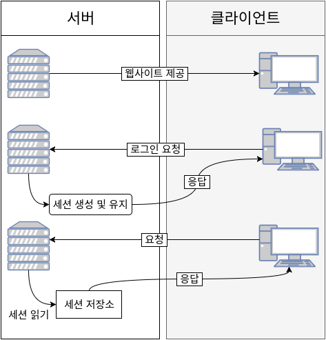
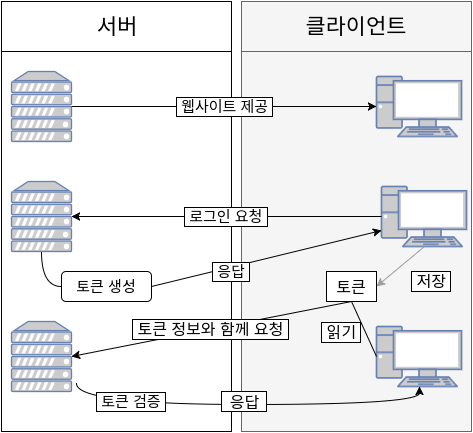
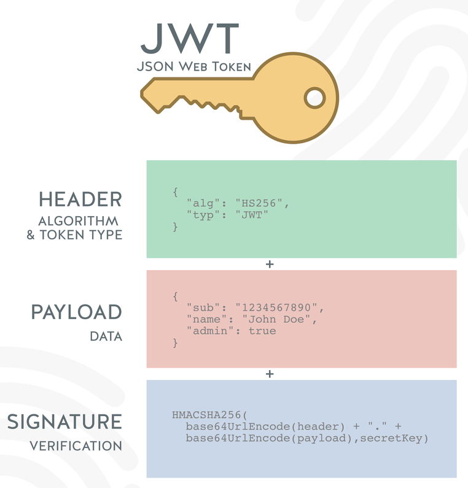

# JWT(JSON Web Token)

# 토큰(Token) 기반 인증

- API를 사용하는 웹 서비스를 개발한다면, 토큰을 사용하여 유저들의 인증 작업을 처리하는 것이 가장 좋은 방법

# 토큰 기반 인증 시스템을 선택하는 중요한 이유는?

## Stateless 서버

- Stateful 서버는 클라이언트에게서 요청을 받을 때마다 클라이언트의 상태를 계속해서 유지하고, 이 정보를 서비스 제공에 이용함
- Stateful 서버는 세션을 유지하는 웹 서버가 있음
  - 예를 들어 유저가 로그인을 하면 세션에 로그인이 되었다고 저장을 해두고, 서비스를 제공할 때에 그 제이터를 사용함
  - 여기서 세션은 서버컴퓨터의 메모리에 담을 때도 있고, 데이터베이스 시스템에 담을 때도 있음
- Stateless 서버는 반대로 상태를 유지하지 않음
- 상태 정보를 저장하지 않으면, 서버는 클라이언트 측에서 들어오는 요청만으로 작업을 처리함
- 이렇게 상태가 없는 경우 클라이언트와 서버의 연결고리가 없기 때문에 서버의 확장성(Scalability)이 높아짐

## 모바일 어플리케이션에 적합

- 안드로이드, iOS 모바일 어플리케이션을 개발한다면, 안전한 API를 만들기 위해선 쿠키같은 인증시스템은 이상적이지 않음
- 쿠키 컨테이너를 사용해야 하는데, 토큰 기반 인증을 도입한다면 간단하게 번거로움을 해결할 수 있음

## 인증 정보를 다른 어플리케이션으로 전달

- 구글, 카카오톡 등 소셜 계정을 이용하여 다른 웹서비스에서 로그인할 수 있게 하는 OAuth가 있음

## 보안

- 토큰 기반 인증 시스템을 사용하여 어플리케이션의 보안을 높일 수 있음
- 단, 토큰 기반 인증을 사용한다고 해서 무조건 해킹의 위함에서 벗어나는 것은 아님

# 왜 토큰을 사용하게 되었을까?

## 서버 기반 인증

- 과거의 인증 시스템에서는 서버측에서 유저들의 정보를 기억하고 있어야 하기 때문에, 세션을 유지하기 위해서 여러가지 방법이 사용됨
- 메모리, 디스크, 데이터베이스 시스템에 저장
- 서버 기반 인증 시스템의 흐름은 다음과 같음
  
- 서버 기반 인증 시스템은 아직도 많이 사용되고 있지만, 요즘 웹/모바일 웹 어플리케이션들이 부흥하게 되면서 이런 방식의 인증 시스템은 문제를 보임

### 서버 기반 인증의 문제점

- 세션
  - 유저가 인증을 할 때 서버는 이 기록을 서버에 저장해야 하는데, 이를 세션이라고 함
  - 대부분의 경우엔 메모리에 세션을 저장하는데, 로그인 중인 유저의 수가 늘어난다면 서버의 램이 과부화됨
  - 이를 피라기 위해 세션을 데이터베이스 시스템이 저장하는 방식도 있지만, 이 또한 유저의 수가 많으면 데이터베이스의 성능에 무리를 줄 수 있음
- 확장성
  - 세션을 사용하면 서버를 확장하는 것이 어려워짐
  - 서버의 확장이란 단순히 서버의 사양을 업그레이드 하는 것이 아니라, 더 많은 트래픽을 감당하기 위하여 여러개의 프로세스를 돌리거나 여러대의 서버 컴퓨터를 추가하는 것을 의미함
  - 세션을 사용하면서 분산된 시스템을 설계하는 건 불가능한 것을 아니지만 과정이 매우 복잡해짐
- CORS(Cross-Origin Resource Sharing)
  - 웹 어플리케이션에서 세션을 관리할 때 자주 사용되는 쿠키는 단일 도메인 및 서브 도메인에서만 작동하도록 설계되어 있음
  - 따라서 쿠키를 여러 도메인에서 관리하는 것은 번거로움

## 토큰 기반 시스템의 작동 원리

- 토큰 기반 시스템은 stateless, 즉 상태 유지를 하지 않음
- 이 시스템에서는 더 이상 유저의 인증 정보를 서버나 세션에 담아두지 않으므로, 서버에서 유저의 인증 정보를 서버측에 담아둠으로서 발생하는 많은 문제점들이 해소됨
- 세션이 존재하지 않으니 유저들이 로그인 되어있는지 신경쓰지 않고 서버를 손쉽게 확장할 수 있음
- 토큰 기반 시스템의 구현방식은 다음과 같음
  
  1. 유저가 아이디와 비밀번호로 로그인을 함
  2. 서버측에서 해당 계정 정보를 검증
  3. 계정 정보가 정확하다면, 서버측에서 유저에게 signed **토큰을 발급**
     - signed 의 의미는 해당 토큰이 서버에서 정상적으로 발급된 토큰임을 증명하는 signature를 지니고 있다는 것
  4. 클라이언트 측에서 전달받은 **토큰을 저장**해두고, 서버에 요청을 할 때 마다 해당 **토큰을 함께 서버에 전달**
  5. 서버는 **토큰을 검증**하고, **요청에 응답**
- 웹 서버에서 토큰을 서버에 전달할 때는 HTTP 요청의 헤더에 토큰 값을 포함시켜서 전달함

# 토큰의 장점

## 무상태(stateless)이며 확장성(scalability)이 있음

- 토큰은 클라이언트 사이드에 저장하기 때문에 완전히 stateless 하며, 서버를 확장하기에 매우 적합한 환경을 제공함
- 만약 세션을 서버 측에 저장하고 있고 서버를 여러 대를 사용하여 요청을 분산했다면, 어떤 유저가 로그인 했을 때 그 유저는 처음 로그인 했었던 그 서버에만 요청을 보내도록 설정을 해야함
- 하지만 토큰을 사용한다면 어떤 서버로 요청이 들어가는지 상관이 없음

## 보안성

- 클라이언트가 서버에 요청을 보낼 때 더이상 쿠키를 전달하지 않기 때문에, 쿠키를 사용함으로 인해 발생하는 취약점이 사라짐
- 하지만 토큰을 사용하는 환경에서도 취약점이 존재할 수 있으니 언제나 대비해야 함

## 확장성(Extensibility)

- 여기서의 확장성(Extensibility)는 로그인 정보가 사용되는 분야를 확장하는 것을 의미함
- 토큰을 사용하여 다른 서비스에서도 권한을 공유할 수 있음
  - 예를 들면, 요즘의 웹 서비스에서는 대부분 구글, 카카오, 네이버, 토스 등의 계정으로 로그인을 할 수 있음
- 토큰 기반 시스템에서는 토큰에 선택적인 권한만 부여해여 발급을 할 수 있음
  - 예를 들어 페이스북 로그인을 했다면, 프로필 정보를 가져오는 권한은 있지만 포스트를 작성할 수 없는 경우

## 여러 플랫폼 및 도메인

- 어플리케이션과 서비스의 규모가 커지면 우리는 여러 디바이스를 호환시키고, 더 많은 종류의 서비스를 제공하게 됨
- 토큰을 사용한다면 어떤 디바이스에서도, 어떤 도메인에서도 토큰만 유효하다면 요청이 정상적으로 처리됨
- 서버측에서 어플리케이션의 응답 부분에 다음 헤더만 포함시켜주면 됨
  ```jsx
  Access-Control-Allow-Origin: *
  ```
- 이런 구조라면, assets 파일들(이미지, css, js, html 파일 등)은 모두 CDN에서 제공하도록 하고, 서버측에서는 오직 API만 다루도록 설계할 수 있음

## 웹 표준 기반

- 토큰 기반 인증 시스템의 구현체인 JWT는 웹 표준 RFC 7519에 등록되어 있음
- 따라서 여러 환경에서 지원되며 수많은 회사의 인프라 스트럭쳐에서 사용되고 있음

# JWT(JSON Web Token)이란?

- JWT(JSON Web Token)은 웹 표준(RFC 7519)으로서 두 개체에서 JSON 객체를 사용하여 가볍고 자가수용적인(self-contained) 방식으로 정보를 안정성있게 전달해줌
  

# 리액트에서 JWT 방식으로 로그인 구현하는 법

1. 클라이언트에서 서버에 로그인 요청을 보냄

   ```jsx
   const handleLogin = async (data) => {
     return await axios.post("http://localhost3000/users/logins", {
       email: data.email,
       password: data.password,
     });
   };
   ```

   - 로그인 요청을 받은 서버는 토큰을 발급해 응답 헤더에 담아 클라이언트로 보냄

2. 요청 데이터에 문제가 없다면 서버는 새로운 토큰을 발급

   ```jsx
   // 사용자 인증 axios 객체 생성
   export const auth = axios.create({
     baseURL: process.env.REACT_APP_SERVER,
   });
   ```

3. 발급한 토큰을 응답 헤더에 담아 클라이언트로 보냄

   ```jsx
   // 웹 스토리지에 저장된 토큰을 서버로 전송
   auth.interceptors.request.use((config) => {
     config.headers["authorization"] = localStorage.getItem("accessToken");
     config.headers["refresh-token"] = localStorage.getItem("refreshToken");
     return config;
   });
   ```

   - refresh token은 access token이 만료됐을 때 access token을 새로 발급해주기 위한 토큰
   - 클라이언트는 토큰의 만료 여부를 알 수 없으므로 요청 헤더에 토큰을 담아 서버로 보냈을 때 서버가 토큰의 만료 여부를 확인하고, refresh 토큰이 유효하다면 서버는 새로운 access 토큰을 발급해 클라이언트로 보내줌
   - 그럼 클라이언트는 응답 헤더에 access 토큰이 있는 걸 확인하고 기존 토큰이 만료됐다는 사실을 알게 되고, 클라이언트는 기존 토큰을 삭제하고 리프레시된 토큰을 다시 저장함
   - 클라이언트는 어떻게 매번 응답 헤더에 리프레시된 토큰이 있는지 확인할까?
     - axios의 interceptors를 이용하면 간단하게 구현할 수 있음
     ```jsx
     instance.interceptors.response.use((response) => {
       // 응답 헤더에 토큰이 있으면 true
       if (response.headers["authorization"]) {
         // 만료된 access 토큰 삭제
         localStorage.removeItem("accessToken");
         // 새로운 access 토큰 저장
         localStorage.setItem("accessToken", response.headers["authorization"]);
         // refrech 토큰 만료
       } else if (response.data.error === "INVALID_TOKEN") {
         // access 토큰 삭제
         localStorage.removeItem("accessToken");
         // refresh 토큰 삭제
         localStorage.removeItem("refreshToken");
         alert("토큰이 만료되었습니다. 다시 로그인해주세요.");
       }
       return response;
     });
     ```
   - 토큰 유효 기간은 access 토큰은 탈취될 가능성이 높으므로 보통 30분에서 2시간 정도로, refresh 토큰은 아예 유효기간을 두지 않거나 한 달에서 3개월까지 두는 곳도 있다고 함

4. 클라이언트는 응답 헤더에서 토큰을 꺼내 웹 스토리지에 저장

   ```jsx
   localStorage.setItem("accessToken", data.headers["authorization"]);
   localStorage.setItem("refreshToken", data.headers["refresh-token"]);
   navigate("/");
   ```

   - 클라이언트는 응답 헤더에 있는 토큰을 웹 스토리지에 저장하고 메인 페이지로 이동

---

참고 사이트

- [https://velopert.com/2350](https://velopert.com/2350)
- [https://velopert.com/2389](https://velopert.com/2389)
- [https://min23th.tistory.com/126](https://min23th.tistory.com/126)
- [https://khys.tistory.com/56](https://khys.tistory.com/56)
