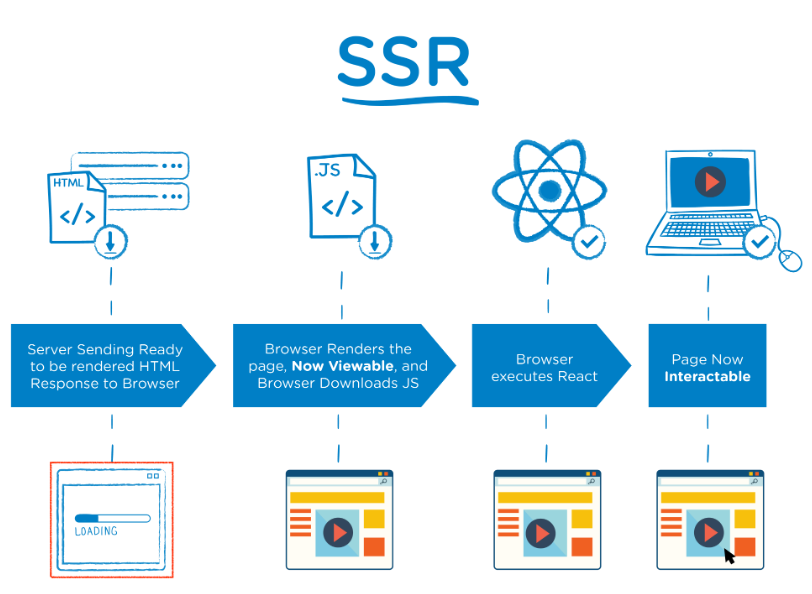
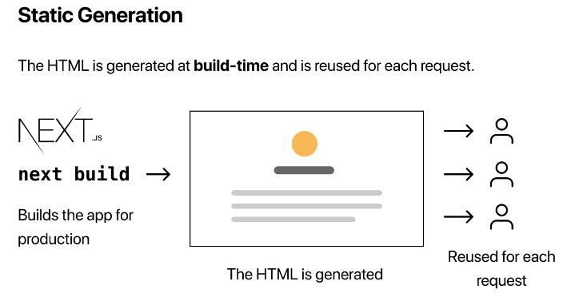

# React vs Next.js

# Next.js 란?

- 리액트를 위해 만든 오픈소스 자바스크립트 웹 프레임워크
- Vercel[1](https://wikidocs.net/197523#fn:myfootnote)에서 개발된 Next.js는 서버 사이드 렌더링(Server-Side Rendering, SSR), 정적 사이트(Static Site Generation, SSG) 생성, API 개발에 대한 쉬운 솔루션을 제공하는 데 중점을 둠

## 서버 사이드 렌더링(Server-Side Rendering, SSR)



- 서버 사용자에게 보여줄 페이지를 모두 구성하여 사용자에게 페이지를 보여주는 방식
- SSR을 사용하면 모든 데이터가 매핑된 서비스 페이지를 클라이언트(브라우저)에게 바로 보여줄 수 있음
- 서버를 이용해서 페이지를 구성하기 때문에 클라이언트에서 구성하는 CSR보다 페이지를 구성하는 속도는 늦어지지만 전체적으로 사용자에게 보여주는 콘텐츠 구성이 완료되는 시점은 빨라진다는 장점이 있음
- 더불어 SEO(Search Engine Optimization) 또한 쉽게 구성할 수 있음

## 정적 사이트 생성(Static Site Generation, SSG)



- 개발자가 빌드 시 사전 생성 페이지(pre-render page)를 만들어 static 페이지로 가지고 있는데, 클라이언트에서 페이지 요청 시 사전 생성 페이지를 로드해서 보여줌
- 페이지를 사전 생성하여 가지고 있기 때문에 클라이언트 요청에 대한 응답이 빠름
- 콘텐츠가 많은 웹사이트나 업데이트 빈도가 낮은 애플리케이션에 적합하며, 빠른 로딩 시간과 효율적인 캐싱을 가능하게 함

# Next.js가 제공하는 주요 기능

## hot reloading

- 핫 모듈 교체를 지원하여 개발자들이 전체 페이지를 새로 고치지 않아도 애플리케이션의 변경 사항을 볼 수 있음
  → 개발 경험을 크게 향상시키고 개발 프로세스를 가속화 함

## automatic routing

- pages 디렉토리의 파일 구조를 기반으로 자동으로 페이지 라우팅을 처리함
  - pages/page1.tsx → localhost:3000/page1
    → 개발 프로세스가 간소화되고 수동으로 라우트를 구성할 필요가 없음

## code splitting

- 각 페이지에서 사용되는 컴포넌트를 기반으로 애플리케이션 코드를 자동으로 작은 번들로 분할하여 사용자가 현재 페이지에 필요한 코드만 다운로드하도록 함
  → 로딩 시간이 단축되고 성능이 향상됨

## 통합된 API 개발

- 개발자들이 애플리케이션 내에서 쉽게 서버리스 API 경로를 생성할 수 있도록 지원하여 풀스택 애플리케이션 개발 프로세스를 간소화하고 프론트엔드와 백엔드 간의 원활한 통신을 가능하게 함

## 하이브리드 렌더링

- 서버 사이드 렌더링(SSR)과 정적 사이트 생성(SSG)을 모두 지원하여 개발자들이 특정 사용 사례에 가장 적합한 방식을 선택하거나 하나의 애플리케이션 내에서 두 기술을 결합할 수 있음

## **내장된 CSS 및 JavaScript 지원**

- CSS 모듈 및 styled-components와 같은 인기 있는 CSS-in-JS 솔루션에 대한 내장 지원이 포함되어 있음
- ES 모듈과 동적 임포트와 같은 현대적인 자바스크립트 기능 지원

```jsx
// styled-jsx

function Heading(props) {
  const variable = "red";
  return (
    <div className="title">
      <h1>{props.heading}</h1>
      <style jsx>
        {`
          h1 {
            color: ${variable};
          }
        `}
      </style>
    </div>
  );
}

export default function Home() {
  return (
    <div>
      // red
      <Heading heading="heading" />
      // block
      <h1>ttt</h1>
    </div>
  );
}
```

## typescript

- 타입스크립트로 작성된 프레임워크이기 때문에 고품질 타입 정의를 지원함
- 최상위 디렉터리 안에 tsconfig.json 타입스크립트 설정 파일을 만든 후에, 의존성 패키지를 설치하면 됨
- 처음에 `npx create-next-app` 으로 설치할 때, 타입스크립트 사용 여부를 선택했다면 따로 설치하지 않아도 됨

# React vs Next.js

- Next.js는 최고의 서버 측 렌더링과 정적 웹 사이트 개발 솔루션 제공하며, 다양한 도구와 기능으로 프로젝트를 쉽게 관리할 수 있음
- React는 SPA용 UI를 개발하는데 가장 적합하며, 모바일 및 웹 앱 레이어와 함께 작동하기 때문에 더욱 매력적이고 직관적인 애플리케이션을 만들 수 있음
- Next.js는 React를 기반으로 하는 프레임워크이고, React.js는 오픈 소스 Javascript 라이브러리
  - Next.js는 웹 애플리케이션을 만들고 서버 측 렌더링을 수행하는데 사용되는 반면, React.js는 DOM을 향한 렌더링에 중점을 둠
  - Next.js는 서버 측 렌더링(SSR)을 제공하는 반면, React.js는 클라이언트 측 렌더링을 제공하여 애플리케이션 성능을 향상시킴
  - Next.js는 React 라이브러리를 사용하여 웹 앱용 UI 및 페이지를 빌드하는데 사용되는 프레임워크이며, React.js는 라이브러리로 UI 구성 요소 부분인 프레임워크의 일부

→ Next.js는 개발 프로세스를 최소화하기 위한 다양한 도구와 기능을 제공하고, React.js는 모바일 및 웹 애플리케이션의 프론트엔드 개발을 위한 더 나은 리소스를 제공함

---

참고 사이트

- [https://m.hanbit.co.kr/channel/category/category_view.html?cms_code=CMS7641364152](https://m.hanbit.co.kr/channel/category/category_view.html?cms_code=CMS7641364152)
- [https://kyounghwan01.github.io/blog/React/next/basic/#prefetching](https://kyounghwan01.github.io/blog/React/next/basic/#prefetching)
- [https://d2.naver.com/helloworld/7804182](https://d2.naver.com/helloworld/7804182)
- [https://wikidocs.net/197523](https://wikidocs.net/197523)
