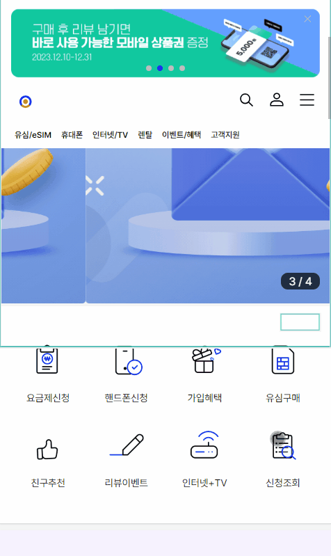

# Scroll Animation

# 1. JavaScript 로 Scroll Animation 구현하기

## 어떻게 동작할까?

1. 애니메이션이 작동할 div에 특정 클래스 이름(ex. .js-scroll)을 붙여줌
2. window scroll event를 통해 스크롤이 발생할 때마다 해당 element들이 viewport안에 들어가는지 검사
3. 만약 element가 viewport에 포함된다면 애니메이션이 실행되는 css를 갖는 특정 클래스(ex. .scrolled)를 해당 element에 붙여주고, viewport 영역에서 벗어나면 특정 클래스 제거

```jsx
const elementInView = (el) => {
  const elementTop = el.getBoundingClientRect().top;

  return (
    elementTop <= (window.innerHeight || document.documentElement.clientHeight)
  );
};
```

# 2. React Custom Hooks로 Scroll Animation 구현하기

- 웹에 Animation이 추가된다면 한 곳에서만 사용하는 것이 아니라, 다양한 곳에 적용하게 되는데 Custom Hook을 사용하여 Animaition을 정의해 둔다면 쉽고 깔끔하게 Animation을 적용할 수 있음

## 1. Animation을 구현

- Animation 트리거 이벤트를 DOM에 지정하기 위해서는 `Ref`를 사용해야 함
- `Ref`는 포커스, 미디어 재생 또는 애니메이션을 직접적으로 실행 시키기 위해 외부에서 DOM(또는 React Component)을 제어 할 수 있게 도와줌
- `hooks` 폴더에 `useScrollFadeIn.js` 라는 파일을 생성 후 `useRef`를 사용하여 ref를 생성 후 return 하는 함수 생성

```jsx
import { useRef } from 'react';

const useScrollFadeIn = () => {
  const dom = useRef();

  return {
    ref: dom,
  };
};
```

- `ref(dom)`을 바로 `return` 하지 않고 Obejct로 한번 감싼 이유는 component에 적용 할 때 Spread와 추후 style 등의 속성이 추가 될 예정이기 때문
- `hooks`를 선언한 후 아래와 같이 사용

```jsx
import React from 'react';
import { useScrollFadeIn } from '@/hooks';

const Contacts = () => {
  const animatedItem = useScrollFadeIn();

  return (
    <Wrapper>
      <Title>Contacts</Title>
      <Description>
        Consequat interdum varius sit amet mattis vulputate enim.
      </Description>
      <Form {...animatedItem} />
    </Wrapper>
  );
};
```

## 2. Scroll 트리거 이벤트 만들기

- Scroll 트리거 이벤트를 만들기 위해서는 스크롤을 감지 해야하고, 언제 반응 할지에 대한 조건이 필요함
- 직접 실시간으로 window의 세로 scroll position 값과 animation을 동작 하게 할 dom element의 position을 비교해서 동작하는 트리거를 만들 수 있지만, `window.addEventListener` 를 통해 직접 스크롤 이벤트를 핸들링 할 경우 **퍼포먼스에 문제가 생김**
  - scroll 이 될 때마다 이벤트 발생(단시간에 수십 ~ 수백 번 호출 됨, 디바운싱 등의 핸들링 필요)
  - `getBoundingClientRect()` 호출 시에 리플로우(레이아웃 전체 리렌더링) 현상 발생(성능 저하)

```jsx
const useScrollFadeIn = () => {
  const dom = useRef();

  const handleScroll = useCallback(([entry]) => {
    const { current } = dom;

    if (entry.isIntersecting) {
      // 원하는 이벤트 추가
    }
  }, []);

  useEffect(() => {
    let observer;
    const { current } = dom;

    if (current) {
      observer = new IntersectionObserver(handleScroll, { threshold: 0.7 });
      observer.observe(current);

      return () => observer && observer.disconnect();
    }
  }, [handleScroll]);

  return {
    ref: dom,
  };
};
```

- `IntersectionObserver`에 동작 하게 할 함수와 Observer 세팅 값들을 넘겨줌
- `threshold`는 `number`나 `Array<number>`로 정의할 수 있으며, Default 값은 0
  - number는 TargetElement의 노출 비율을 말하는 것이며, 0.7은 70% 정도 노출 되었을 때 해당 이벤트가 실행됨
  - Array는 각각의 비율로 노출 될 때마다 함수가 실행됨

## 3. Animation 트리거 이벤트를 DOM에 지정

- FadeIn Animation은 css의 `opacity`와 `transform` 그리고 `transition`을 사용하여 구현 할 수 있음
  - 이벤트 트리거가 발생 하기 전에는 `opacity: 0`, `transform: translate3d(0, 50%, 0)translate3d(0, 50%, 0)` 으로 원하는 위치 아래에 숨겨둠
  - 트리거가 발생 할 때, `opacity:1`, `transform: translate3d(0, 0, 0)` 과 같이 제자리에 돌아오게 함

```jsx
const useScrollFadeIn = () => {
  const dom = useRef();

  const handleScroll = useCallback(([entry]) => {
    const { current } = dom;

    if (entry.isIntersecting) {
      current.style.transitionProperty = 'opacity transform';
      current.style.transitionDuration = '1s';
      current.style.transitionTimingFunction = 'cubic-bezier(0, 0, 0.2, 1)';
      current.style.transitionDelay = '0s';
      current.style.opacity = 1;
      current.style.transform = 'translate3d(0, 0, 0)';
    }
  }, []);

  useEffect(() => {
    let observer;
    const { current } = dom;

    if (current) {
      observer = new IntersectionObserver(handleScroll, { threshold: 0.7 });
      observer.observe(current);

      return () => observer && observer.disconnect();
    }
  }, [handleScroll]);

  return {
    ref: dom,
    style: {
      opacity: 0,
      transform: 'translate3d(0, 50%, 0)',
    },
  };
};
```

- 위와 같이 `return` 시 초기에 숨겨두기 위한 `style` object들을 설정
- 외부의 영향을 최소화 하기 위해 style은 직접 주입하며, 만약 기존에 opacity 등을 사용했다면 레이아웃이 깨질 수 있음

# 3. react-spring 라이브러리로 구현하기

## react-spring이란?

- React 애플리케이션에서 물리 기반 애니메이션을 구현하기 위한 오픈 소스 라이브러리
- 자연스럽고 부드러운 애니메이션을 만들기 위해 사용되며, 높은 성능과 직관적인 API를 제공

### 주요 특징

1. 물리 기반 애니메이션: 스프링 시뮬레이션을 사용하여 자연스러운 움직임을 만들고, 이를 통해 개발자는 인터페이스의 요소를 간편하게 애니메이션 처리 가능
2. 성능 최적화: 최적의 성능을 위해 requestAnimationFrame, will-change 및 인터폴레이션과 같은 기술 사용. 불필요한 오버헤드를 방지하고, 리렌더링을 일으키지 않음
3. 직관적인 API: 사용하기 쉬운 API 훅 6개(useSpring 등)를 제공하여 개발자가 빠르게 애니메이션을 구현할 수 있게 해주고, 기존 코드베이스에 쉽게 통합할 수 있도록 Typescript로 작성됨
4. 플랫폼 독립성: React, React-Native, React-Native-Web 모두 작동

## react-spring으로 배너에 애니메이션 구현하기

- 애니메이션 배너 컴포넌트 만들기

```html
import clsx from 'clsx'; import { useRouter } from 'next/router'; import {
StaticImageData } from 'next/image'; import { AnimationBannerStyled } from
'./styled'; import { useEffect, useState, useRef } from 'react'; import {
useSpring, animated } from '@react-spring/web'; export interface
AnimationBannerProps { className?: string; imageSrc: StaticImageData; } const
AnimationBanner = ({ className, imageSrc }: AnimationBannerProps) => { // 배너
애니메이션 효과 const bannerRef = useRef<HTMLDivElement
  >(null); const [isInViewPort, setIsInViewPort] = useState(false); useEffect(()
  => { const handleScroll = () => { const bannerRect =
  bannerRef.current?.getBoundingClientRect(); const isInView = bannerRect !==
  undefined && bannerRect.top < window.innerHeight && bannerRect.bottom > 0;
  setIsInViewPort(isInView); }; window.addEventListener('scroll', handleScroll);
  return () => { window.removeEventListener('scroll', handleScroll); }; }, []);
  const bannerAnimation = useSpring({ opacity: isInViewPort ? 1 : 0, transform:
  isInViewPort ? 'translateY(0)' : 'translateY(100%)', config: { duration: 500
  }, }); return (
  <AnimationBannerStyled>
    <animated.div ref="{bannerRef" as React.MutableRefObject<HTMLDivElement
      >} style={bannerAnimation} className="phonePlanBanner" >
      
    </animated.div>
  </AnimationBannerStyled>
  ); }; export default AnimationBanner;</HTMLDivElement
>
```

- 배너가 필요한 곳에 컴포넌트 삽입

```html
import clsx from 'clsx'; import { useRouter } from 'next/router'; import {
BestPlanStyled } from './styled'; import { useEffect, useState } from 'react';
import phoneimg from '~images/phoneList.png'; import bestPlanBanner from
'~images/banner_bestPlan.png'; import { BestPlanItem } from
'~/components/Main/BestPlanItem'; import gift from
'~/assets/svg/list/ico_gift.svg'; import AnimationBanner from
'~/components/AnimationBanner'; export interface BestPlanProps { className?:
string; } const BestPlan = ({ className }: BestPlanProps) => { const router =
useRouter(); // 더미데이터 const data = [ { image: phoneimg, title: '공신폰',
company1: 'U+', company2: 'U+알뜰폰', before: 39000, after: 30200, info: '* 3년
약정, 설치비 별도', gift: '현금 40만원', }, { image: phoneimg, title: '공신폰',
company1: 'KT', company2: 'KT알뜰폰', before: 39000, after: 30200, info: '* 3년
약정, 설치비 별도', gift: '현금 40만원', }, { image: phoneimg, title: '공신폰',
company1: 'SK', company2: 'SK알뜰폰', before: 39000, after: 30200, info: '* 3년
약정, 설치비 별도', gift: '현금 40만원', }, ]; return (
<BestPlanStyled>
  <div className="BestPhoneWrap">
    <AnimationBanner imageSrc="{bestPlanBanner}" />

    <div>
      {data?.map((x: any, i: number) => { return
      <BestPlanItem key="{i}" data="{x}" />; })}
    </div>
    <div className="moreBtn">더보기</div>
  </div>
</BestPlanStyled>
); }; export default BestPlan;
```

- 구현 결과



---

참고 사이트

- [https://velog.io/@syoung125/웹에서-애니메이션을-다뤄보자-2](https://velog.io/@syoung125/%EC%9B%B9%EC%97%90%EC%84%9C-%EC%95%A0%EB%8B%88%EB%A9%94%EC%9D%B4%EC%85%98%EC%9D%84-%EB%8B%A4%EB%A4%84%EB%B3%B4%EC%9E%90-2)
- [https://shylog.com/react-custom-hooks-scroll-animation-fadein/](https://shylog.com/react-custom-hooks-scroll-animation-fadein/)
- [https://www.react-spring.dev/](https://www.react-spring.dev/)
