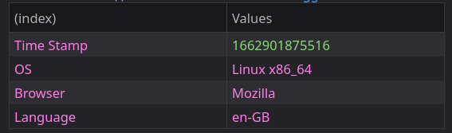
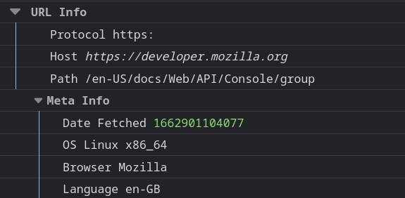
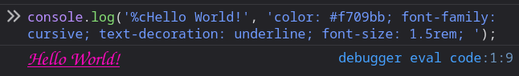
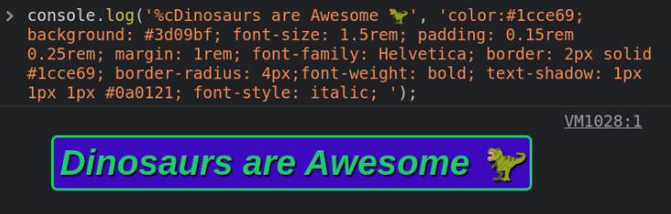
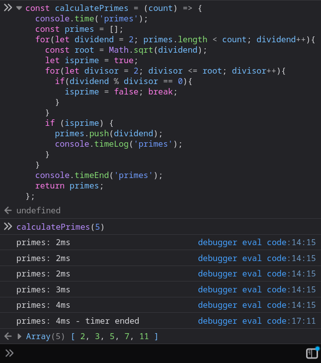
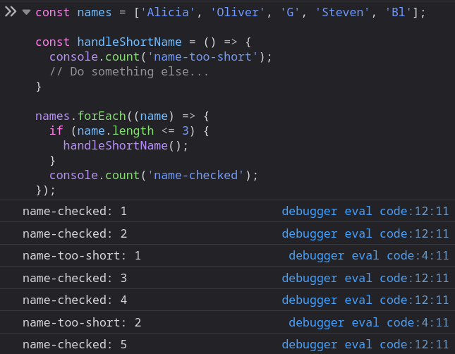
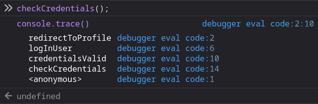
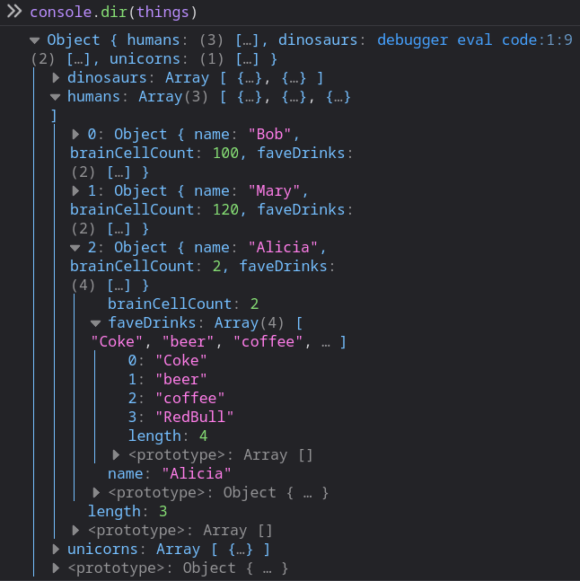
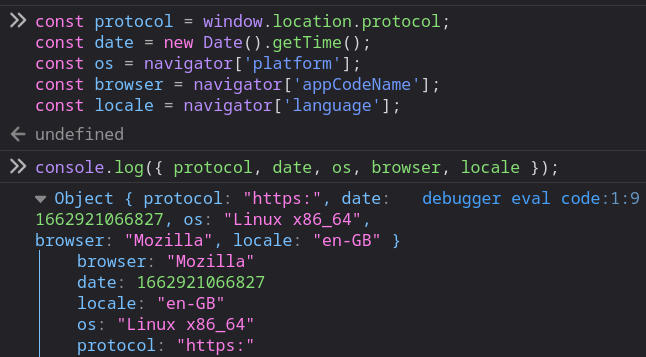

# console.log() 활용하기

- 웹 앱을 개발한 적이 있다면, `console.log(...)`는 이미 익숙함
- 이 메서드는 개발자 콘솔에 데이터를 출력하며, 디버깅과 로깅, 그리고 테스트에 유용하게 사용
- `console.log(console)`을 실행하면, `console` 객체에 훨씬 더 많은 것이 있음을 알게됨

# 로깅 경험을 향상할 수 있는 console 활용법

## Tables

- `console.table()` 메서드는 객체/배열을 깔끔한 형식의 테이블로 출력

```jsx
console.table({
  'Time Stamp': new Date().getTime(),
  OS: navigator['platform'],
  Browser: navigator['appCodeName'],
  Language: navigator['language'],
});
```



## Groups

- `console.group()` 사용하여 관련된 콘솔 문을 접을 수 있는 섹션과 함께 그룹화할 수 있음
- 문자열을 매개 변수로 전달하여 선택적으로 섹션에 제목을 지정할 수 있음
- 콘솔에서 섹션을 접고 펼칠 수 있지만, `group` 대신 `groupCollapsed`를 사용하여 기본적으로 접힌 채로 표시할 수도 있음
- 섹션 내에 하위 섹션을 중첩하는 것도 가능하지만 `groupEnd`를 사용하여 각 그룹을 닫아야 함

```jsx
console.group('URL Info');
console.log('Protocol', window.location.protocol);
console.log('Host', window.origin);
console.log('Path', window.location.pathname);
console.groupCollapsed('Meta Info');
console.log('Date Fetched', new Date().getTime());
console.log('OS', navigator['platform']);
console.log('Browser', navigator['appCodeName']);
console.log('Language', navigator['language']);
console.groupEnd();
console.groupEnd();
```



## **Styled Logs**

- 색상, 글꼴, 텍스트 스타일 및 크기와 같은 기본 CSS로 로그 출력을 스타일링할 수 있음

```jsx
console.log(
  '%cHello World!',
  'color: #f709bb; font-family: sans-serif; text-decoration: underline;'
);
```



- 글꼴, 스타일, 배경색을 변경하거나 그림자나 곡선을 추가할 수도 있음



## **Time**

- 또 다른 일반적인 디버깅 기법은 실행 시간을 측정하여 작업에 걸리는 시간을 추적하는 것
- 이는 `console.time()`을 사용하여 타이머를 시작하고 매개변수로 레이블을 전달한 다음, 동일한 레이블을 매개변수로 `console.timeEnd()`를 사용하여 타이머를 종료할 수 있음
- 또한 `console.timeLog()`를 사용하여 장기 실행 작업 내에 마커를 추가할 수도 있음

```jsx
console.time('concatenation');
let output = '';
for (var i = 1; i <= 1e6; i++) {
  output += i;
}
console.timeEnd('concatenation');
```

```jsx
concatenation: 1206ms - timer ended
```



- 성능 탭 내에 마커를 추가하는 비표준 메서드인 `console.timeStamp()`는 페인트 및 레이아웃 이벤트와 같이 타임라인에 기록된 다른 이벤트들과 코드의 특정 지점을 함께 연관시킬 수 있음

## **Assert**

- 오류가 발생하거나 특정 조건이 참 또는 거짓인 경우에만 콘솔에 기록할 수 있음
- 이 작업은 `console.assert()`를 사용하여 수행할 수 있으며, 첫 번째 매개 변수가 `false`가 아니면 콘솔에 아무것도 기록하지 않음
- 첫 번째 매개 변수는 체크할 부울 조건이며, 그다음 매개 변수는 출력하고자 하는 0개 혹은 많은 데이터 지점들, 그리고 마지막 매개 변수는 출력할 메시지임
- `console.assert(false, 'Value was false')` 첫 번째 매개 변수가 `false`이기 때문에 메시지를 출력함

```jsx
const errorMsg = 'the # is not even';
for (let num = 2; num <= 5; num++) {
  console.log(`the # is ${num}`);
  console.assert(num % 2 === 0, { num }, errorMsg);
}
```


## **Count**

- `console.count()`는 어떤 것이 실행된 횟수 또는 코드 블록이 입력된 빈도를 추적하는 데 유용함
- 선택적으로 카운터에 레이블을 지정하여 여러 카운터를 관리하고 출력을 더 명확하게 만들 수 있음
- 카운터는 항상 1부터 시작하고, `console.countReset()`을 사용하여 언제든지 카운터를 리셋할 수 있음
- 다음 코드는 각 항목에 대한 카운터를 증가시키며, 최종값은 8이 됨

```jsx
const numbers = [1, 2, 3, 30, 69, 120, 240, 420];
numbers.forEach((name) => {
  console.count();
});
```

- 다음은 레이블이 지정된 카운터의 출력 예



- 레이블을 전달하는 대신 값을 사용하면 각 조건 값에 대해 별도의 카운터를 가질 수 있음

```jsx
console.count(NaN); // NaN: 1
console.count(NaN + 3); // NaN: 2
console.count(1 / 0); // Infinity: 1
console.count(String(1 / 0)); // Infinity: 2
```

## **Trace**

- 자바스크립트에서 우리는 종종 깊게 중첩된 메서드와 객체를 사용함
- `console.trace()`를 사용하여 스택 추적을 할 수 있고, 특정 지점에 도달하기 위해 호출된 메서드를 출력할 수 있음



- 선택적으로 스택 추적과 함께 출력될 데이터를 전달할 수 있음

## **Dir**

- 콘솔에 큰 객체를 로깅하는 경우, 그것은 읽기 어려울 수 있는데 `console.dir()` 메서드를 사용하여 확장 가능한 트리 구조로 형식을 지정함
- 다음은 디렉터리 스타일 콘솔 출력의 예시



- `console.dirxml()`을 사용하여 유사한 방법으로 XML 또는 HTML 기반 트리를 인쇄할 수 있음

## **Debug**

- 엡 내에 여러분이 개발 중에 사용하는 몇몇 로그가 설정되어 있을 수 있지만, 그것들이 사용자에게 보이기를 원하지 않음
- 로그 구문을 `console.debug()`로 대체하면 `console.log`와 정확히 같은 방식으로 작동하지만, 빌드 시스템에서 제거되거나 프로덕션 모드에서 실행될 때는 비활성화됨

### 로그 수준

- 브라우저 콘솔에는 여러 필터(정보, 경고, 에러)가 있으며, 이를 통해 로그된 데이터의 상세 정도를 변경할 수 있음
  - `console.info()` - 로깅 목적의 정보성 메시지로, 일반적으로 작은 “i”와/또는 파란색 배경을 포함합니다.
  - `console.warn()` - 경고 / 치명적이지 않은 오류를 나타내며, 일반적으로 삼각형 느낌표 마크 와/또는 노란색 배경을 포함합니다.
  - `console.error()` - 기능에 영향을 미칠 수 있는 오류를 나타내며, 일반적으로 원형 느낌표와/또는 빨간 배경을 포함합니다.
- Node.js에서 서로 다른 로그 레벨은 운영 환경에서 실행될 때 서로 다른 스트림에 기록됨
- 예를 들어 운영 환경에서 `error()`는 `stderr`에 기록되고 `log`는 `stdout`에 출력되지만, 개발 환경에서는 모두 정상적으로 콘솔에 표시됨

## **다중 값 로그**

- `console` 객체는 대부분 여러 매개 변수를 허용하므로 출력에 레이블을 추가하거나 한 번에 여러 데이터 지점을 출력할 수 있음
- 예를 들면, `console.log('User: ', user.name);`
- 그러나 레이블이 지정된 여러 값을 인쇄하는 더 쉬운 접근법은 [구조 분해 할당(object deconstructing)](https://developer.mozilla.org/en-US/docs/Web/JavaScript/Reference/Operators/Destructuring_assignment)을 사용하는 것
- 예를 들어, `x`,`y`,`z`와 같은 세 개의 변수가 있는 경우, 각 변수 이름과 값이 출력되도록 `console.log({x, y, z});`와 같이 중괄호로 둘러싸서 객체로 로깅 할 수 있음



## **로그 문자열 형식**

- 출력할 형식 문자열을 빌드해야 하는 경우, 형식 지정자를 사용하여 C언어 스타일 printf를 사용할 수 있음
- 다음과 같은 지정자들이 지원됨
  - `%s` - 문자열 또는 문자열로 변환되는 다른 모든 타입
  - `%d` / `%i` - 정수
  - `%f` - 실수
  - `%o` - 최적의 형식 사용
  - `%O` - 기본 형식 사용
  - `%c` - 사용자 정의 형식 사용 ([더 많은 정보](https://ykss.netlify.app/translation/fun-with-console-log/#styled-logs))

```jsx
console.log(
  'Hello %s, welcome to the year %d!',
  'Alicia',
  new Date().getFullYear()
);
// Hello Alicia, welcome to the year 2022!
```

- 물론 [템플릿 리터럴](https://developer.mozilla.org/en-US/docs/Web/JavaScript/Reference/Template_literals)을 사용하여 동일한 작업을 수행할 수도 있지 짧은 문자열의 경우 템플릿 리터럴 방식이 더 읽기 쉬움

## **Clear**

- 마지막으로 이 작업은 `console.clear()`를 사용하여 수행할 수 있으며, 모든 내용을 지우지만, 어떤 데이터도 초기화하지 않음
- 일반적으로 휴지통 아이콘을 클릭하여 콘솔을 지울 수 있고, 필터 텍스트 입력을 통해 콘솔을 검색할 수도 있음

## **특별한 브라우저 메서드**

- 브라우저 콘솔에서 직접 코드를 실행할 때, 디버깅, 자동화 및 테스트에 매우 유용한 몇 가지 간단한 메서드를 사용할 수 있음
- 그중 가장 유용한 것들은 다음과 같음
  - `$()` - `Document.querySelector()`의 약어입니다. (DOM 요소를 선택하기 위한 jQuery 스타일)
  - `$$()` - 위와 동일하지만, 배열에서 여러 요소를 반환할 때 모두를 선택(`selectAll`) 합니다.
  - `$_` - 마지막으로 평가된 식의 값을 반환합니다.
  - `$0` - 검사 창에서 가장 최근에 선택한 DOM 요소를 반환합니다.
  - `$1`…`$4`를 사용하여 이전에 선택한 UI 요소를 가져올 수 있습니다.
  - `$x()` - Xpath 쿼리를 사용하여 DOM 요소를 선택할 수 있습니다.
  - `keys()` 와 `values()` - Object.getKeys()의 약어로 객체의 키 또는 값의 배열을 반환합니다.
  - `copy()` - 클립보드에 내용을 복사합니다.
  - `monitorEvents()` - 지정된 이벤트가 발생할 때마다 명령을 실행합니다.
  - `console.table()`과 같은 특정 공통 콘솔 명령의 경우, 앞에 `console.`을 입력할 필요 없이, `table()`만 입력해도 됩니다.
- 콘솔에 로깅할 수 있는 작업은 훨씬 더 많으므로, 자세한 내용은 [MDN `console` 문서](https://developer.mozilla.org/en-US/docs/Web/API/console) 또는 [크롬 개발자 콘솔 문서](https://developer.chrome.com/docs/devtools/console/api/)에서 확인 가능

---

참고 사이트

- [https://ykss.netlify.app/translation/fun-with-console-log/](https://ykss.netlify.app/translation/fun-with-console-log/)
