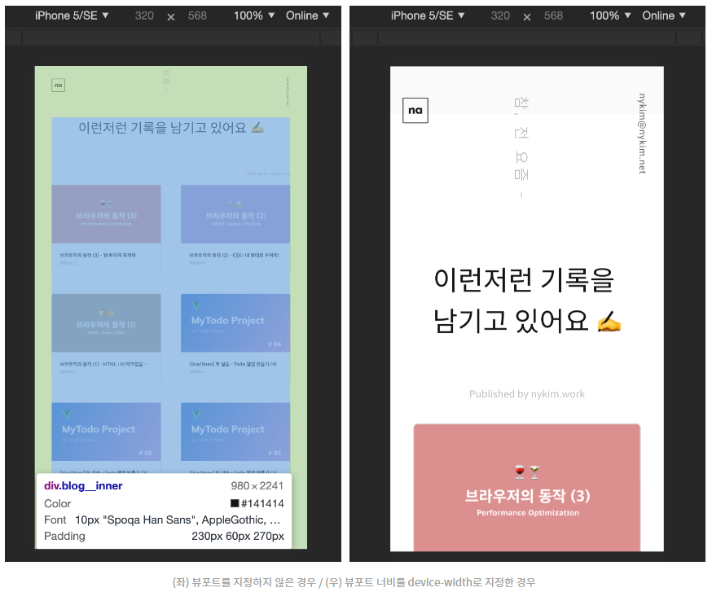
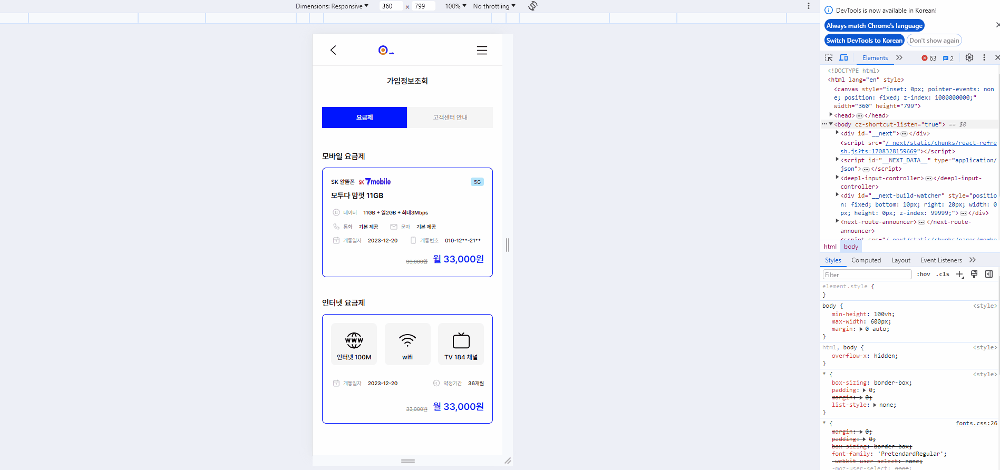

# 반응형 웹 - 뷰포트 메타 태그와 미디어 쿼리

# meta 태그 - viewport

## 뷰포트(viewport)

- 웹 페이지에서 사용자의 보이는 영역(visible area)
    - 같은 페이지라 하더라도 모바일과 태블릿은 화면 크기가 다르기 때문에 사용자가 볼 수 있는 범위가 다름
    - 따라서 메타 태그는 뷰포트를 지정해주는 역할을 함
    
    ```html
    <meta name="viewport" content="width=device-width,initial-scale=1">
    ```
    
    - `width`: 뷰포트의 가로 크기를 정함
        - 만약 500이란 값을 넣으면, 500만큼의 픽셀 개수를 가진 너비로 설정됨
        - device-width라고 지정하면 기기의 스크린 너비에 맞추라는 뜻
    - `initial-scale` : 페이지에 처음 접속했을 때 보여질 확대 배율을 설정
        - 1로 정하면 CSS 픽셀과 화면에 보여질 픽셀이 1:1을 이룸
        - 이 값이 1보다 작다면 페이지는 축소되어 보이고, 1보다 크면 확대되어 보임

- width와 initial-scale을 지정하지 않으면 어떻게 될까?
    
    
    
    - 뷰포트를 정하지 않으면 width는 기본값인 980이 되므로 width: 100% 를 지정한 요소는 980px 값을 가지게 됨
    - 따라서 모바일은 이 980px짜리 페이지를 어떻게든 사용자에게 보여주려고 배율을 줄임(왼쪽 이미지)
    - 반면, 오른쪽 이미지처럼 메타 태그를 지정한 경우엔 width: 100%가 iPhone5에선 320px, iPad에선 768px이 되기 때문에 사용자가 보다 편안하게 웹 페이지를 볼 수 있음
    
- 뷰포트 메타태그에 들어갈 수 있는 속성들
    - user-scalable: 사용자의 축소/확대 허용 여부. 초기값은 yes이며, no로 지정하면 금지할 수 있음
    - mininum-scale: 뷰포트의 최소 배율 값(0 ~ 10)
    - maximum-scale: 뷰포트의 최대 배율 값(0 ~ 10)

# 미디어 쿼리

- 미디어 쿼리는 반응형 웹을 위한 기본이자 핵심
    - 타이틀의 텍스트 크기를 40px로 하되, 600px보다 작은 화면에서는 20px로 줄일 때 미디어 쿼리 활용 예시
        
        ```jsx
        .title {
          font-size: 40px;
        }
         
        @media (max-width: 600px) {
          .title {
            font-size: 20px;
          }
        }
        ```
        
        
        
- 모바일 시안을 받았다면, 분기점을 정한 뒤 시안의 사이즈에 맞춰 미디어 쿼리를 지정해 주면 됨

## 미디어 쿼리 적용하기

- CSS 파일 내에 직접 작성하기
    
    ```jsx
    @media (min-width:768px) {
    
    }
    ```
    
- <link> 태그에 media 속성을 설정해 사용하기
    
    ```jsx
    <link rel="stylesheet" media="all and (min-width:1200px)" href="desktop.css" >
    <link rel="stylesheet" media="all and (min-width:768px) and (max-width:1199px)" href="laptop.css" >
    ```
    
- 대부분의 경우 CSS 파일에 직접 작성하는 방법을 사용함
    - HTTP 요청이 많아지면 성능이 그만큼 저하되므로, CSS 파일 내에서 @media로 분리하는 것을 추천

## 모바일과 데스크탑,  누가 먼저?

- 미디어 쿼리의 분기는 대부분 width 값을 사용하는데, 이때 min을 쓸지 max를 쓸지 고민될 때가 있음
- 보통 두 가지 방법이 있는데, 결과물은 똑같은데 작성 방식에만 차이가 있음
    - 모바일에 대한 스타일이 우선 적용 되도록 분기점이 낮은 순으로 작성
        
        ```jsx
        /* Mobile First */
         
        .title { font-size: 12px; }
         
        @media (min-width: 640px) {
          .title { font-size: 14px; }
        }
         
        @media (min-width: 768px) {
          .title { font-size: 16px; }
        }
         
        @media (min-width: 1024px) {
          .title { font-size: 18px; }
        }
        ```
        
    - 데스크탑에 대한 스타일이 우선 적용 되도록 분기점이 높은 순으로 작성
        
        ```jsx
        /* Desktop First */
         
        .title { font-size: 18px; }
         
        @media (max-width: 1023px) {
          .title { font-size: 16px; }
        }
         
        @media (max-width: 767px) {
          .title { font-size: 14px; }
        }
         
        @media (max-width: 639px) {
          .title { font-size: 12px; }
        }
        ```
        

## 반응형 웹 페이지 만들기

- 모바일 화면 크기(최소 360px)로 작업한 다음, PC 화면 크기(최소 1200px)로 작업
- 배치 수정 만으로 가능한 경우 미디어 쿼리를 사용
    
    ```jsx
    import { Input, Modal, Select } from 'antd';
    import { QnaWritFormStyled } from './styled';
    import SubmitButton from '~/components/SubmitButton';
    import { useEffect, useState } from 'react';
    import { useGet } from '~/packages/modules';
    import { useFormik } from 'formik';
    import client from '~/packages/modules/src/client';
    import { useRouter } from 'next/router';
    import CheckMobileSize from '~/components/Custom/checkWidth';
    
    const { TextArea } = Input;
    
    export interface notLoginProps {
      notLogin?: any;
      user?: any;
    }
    
    // 현재는 문자인증 형식이지만 Pass로 변경될 예정입니다.
    
    const QnaWriteForm = ({ notLogin, user }: notLoginProps) => {
      const router = useRouter();
      const [choiceData, setChoiceData] = useState<string>('');
      const [subCategoryData, setSubCategoryData] = useState<any>([]);
      const [choiceSubData, setChoiceSubData] = useState<string>('');
      const { data: _categoryData } = useGet('/mcc-inquiry-core/all-type');
      //window 객체(모바일, PC 화면 크기 확인용)
      const checkMobile = CheckMobileSize();
    
      const qnaWriteForm = useFormik({
        initialValues: {
          title: '',
          contents: '',
        },
        onSubmit: async values => {
          const sendData = {
            ...values,
            userId: user ? user.id : null,
            uniqueKey: user ? null : notLogin.uuid,
            rootTypeId: +choiceData,
            subTypeId: +choiceSubData,
          };
          console.log(user, sendData);
    
          try {
            const { status } = await client.post(
              '/mcc-inquiry-core/create-inquiry',
              sendData,
            );
            console.log(status);
            if (status === 201) {
              Modal.success({
                title: '1:1문의 신청이 완료 되었습니다.',
                onOk: () => {
                  Modal.destroyAll(), router.push('/cs/qna/result');
                },
              });
            }
          } catch (error) {
            Modal.error({
              title: '1:1문의 신청이 실패했습니다.',
            });
          }
        },
      });
    
      useEffect(() => {
        if (choiceData && _categoryData) {
          const filterData = _categoryData.filter(
            (item: any) => item.id === choiceData,
          );
    
          setSubCategoryData(filterData[0]);
        }
      }, [choiceData]);
      console.log(subCategoryData);
    
      return (
        <QnaWritFormStyled>
          {!checkMobile?.mobile && <p className="title">1:1 문의 하기</p>}
          {!checkMobile?.mobile && <p className="subTitle">문의 작성</p>}
          {checkMobile?.mobile ? (
            <div className="explainText">
              <p className="star">*</p>원모바일 서비스에 대해 궁금한 사항을 문의해
              주시면 답변 드리도록 하겠습니다. 주말 및 휴일에는 답변 처리가 다소
              지연될 수 있습니다.
            </div>
          ) : (
            <div className="explainText">
              <p className="star">*</p>원모바일 서비스에 대해 궁금한 사항을 문의해
              주시면 답변 드리도록 하겠습니다. <br />
              주말 및 휴일에는 답변 처리가 다소 지연될 수 있습니다.
            </div>
          )}
          <form onSubmit={qnaWriteForm.handleSubmit}>
            <div className="qnaForm">
              <p className="selectTitle">문의 유형</p>
              <div className="selectFormWrap">
                <Select
                  placeholder={'문의 유형을 선택해주세요'}
                  value={choiceData === '' ? null : choiceData}
                  onChange={value => {
                    setChoiceData(value);
                    setChoiceSubData('');
                  }}
                  options={_categoryData?.map((item: any) => ({
                    value: item.id,
                    label: item.typeText,
                  }))}
                />
                <Select
                  value={choiceSubData === '' ? null : choiceSubData}
                  disabled={subCategoryData?.length === 0}
                  placeholder={'세부유형을 선택해주세요'}
                  onChange={value => setChoiceSubData(value)}
                  options={subCategoryData?.subTypes?.map((category: any) => ({
                    value: category.id,
                    label: category.typeText,
                  }))}
                />
              </div>
    
              <div className="writeFormWrap">
                <p>문의 작성</p>
                <Input
                  placeholder="제목을 입력해 주세요"
                  value={qnaWriteForm.values.title}
                  onChange={({ target }) =>
                    qnaWriteForm.setFieldValue('title', target.value)
                  }
                />
                <TextArea
                  placeholder="문의 내용을 입력해 주세요 (1,000자 이내)"
                  value={qnaWriteForm.values.contents}
                  onChange={({ target }) =>
                    qnaWriteForm.setFieldValue('contents', target.value)
                  }
                />
              </div>
              {/* <div>
              <p>휴대폰 번호</p>
              <Input placeholder="휴대폰 번호를 입력해주세요" />
            </div> */}
              <SubmitButton text="완료" submitCheck margin={checkMobile?.mobile ? "2.5rem 0px 3.75rem" : "5rem 0 8rem"} />
            </div>
          </form>
        </QnaWritFormStyled>
      );
    };
    
    export default QnaWriteForm;
    ```
    
    ```jsx
    import styled from 'styled-components';
    
    export const QnaWritFormStyled = styled.div`
      padding: 0 1.125rem;
      .explainText {
        display: flex;
        font-size: 0.75rem;
        color: #757575;
        margin-bottom: 2.5rem;
    
        .star {
          margin-right: 0.2rem;
        }
      }
      .qnaForm {
        display: flex;
        flex-direction: column;
    
        .selectTitle {
          font-size: 0.9375rem;
          font-family: 'PretendardSBold';
          margin-bottom: 0.75rem;
        }
    
        .selectFormWrap {
          display: flex;
          flex-direction: column;
          gap: 0.75rem;
          margin-bottom: 1.25rem;
        }
    
        .writeFormWrap {
          display: flex;
          flex-direction: column;
          gap: 0.75rem;
          p {
            font-size: 0.9375rem;
            font-family: 'PretendardSBold';
          }
          input {
            font-size: 0.75rem;
            font-family: 'PretendardRegular';
          }
    
          textarea {
            resize: none;
            height: 11.5rem;
            font-size: 0.75rem;
            font-family: 'PretendardRegular';
            padding: 0.813rem 0.635rem;
          }
        }
      }
      .ant-select {
        width: 100%;
    
        .ant-select-selector {
          font-size: 0.75rem;
          color: #757575;
        }
      }
    
      /* PC 버전 css*/
      @media screen and (min-width: 1200px) {
        max-width: 1288px;
        margin: 0 auto;
        display: flex;
        flex-direction: column;
        padding: unset;
        width: 100%;
    
        .title {
          margin: unset;
          padding: 1.9rem 0;
          font-size: 1.8rem;
          font-family: 'PretendardSBold';
          text-align: left;
          margin-bottom: 5rem;
        }
    
        .subTitle {
          font-size: 1.6rem;
          font-family: 'PretendardSBold';
          margin-bottom: 1rem;
        }
    
        .explainText {
          font-size: 1.3rem;
          color: #000000;
          letter-spacing: -1.04px;
          padding: 3rem 2rem;
          background-color: #f5f5f5;
          border-top: solid 0.1rem #0015ff;
          margin-bottom: 3rem;
    
          .star {
            margin-right: 0.5rem;
          }
        }
    
        form {
          .qnaForm {
            max-width: 1288px;
            display: flex;
            align-items: center;
    
            .selectTitle {
              font-size: 1.3rem;
              margin-bottom: 1rem;
              width: 100%;
              display: flex;
            }
    
            .selectFormWrap {
              display: flex;
              flex-direction: row;
              margin-bottom: 4.375rem;
    
              .ant-select {
                width: 31.9rem;
                height: 3rem;
                border-radius: 0.4rem;
    
                .ant-select-selector {
                  font-size: 0.9rem;
                  padding: 1rem 1.5rem;
                }
    
                .ant-select-arrow {
                  width: 1.5rem;
                }
              }
            }
    
            .writeFormWrap {
              width: 100%;
              gap: 1rem;
    
              p {
                font-size: 1.3rem;
              }
    
              input {
                height: 3rem;
                border-radius: 0.4rem;
                font-size: 0.9rem;
                padding: 1rem 1.5rem;
              }
    
              textarea {
                height: 12rem;
                border-radius: 0.5rem;
                font-size: 0.9rem;
                padding: 1rem 1.5rem;
              }
            }
    
            button {
              width: 32rem;
              height: 4rem;
              font-size: 1.1rem;
            }
          }
        }
      }
    `;
    ```
    

- 전체적으로 디자인이 크게 변하는 경우엔 화면 크기를 체크하는 함수를 활용해서 화면 크기에 따라 다른 컴포넌트를 보여주도록 함
    
    ```jsx
    import { MyPlanStyled } from './styled';
    import sk7mobile from '~images/logo/sk7mobile_로고.png';
    import { numberWithCommas } from '~/features/Usim/index';
    import phoneData from '~/assets/svg/list/ico_data.svg';
    import phoneCall from '~/assets/svg/list/ico_call.svg';
    import phoneMail from '~/assets/svg/list/ico_mail.svg';
    import calendar from '~/assets/svg/list/ico_calendar.svg';
    import phone from '~/assets/svg/list/ico_phone.svg';
    import clock from '~/assets/svg/list/ico_clock.svg';
    import uPlus from '~images/logo/ico_u+.svg';
    import kt from '~images/logo/ico_kt.svg';
    import sk from '~images/logo/ico_sk.svg';
    import internet from '~icons/ico_internet.svg';
    import wifi from '~icons/ico_wifi.svg';
    import tv from '~icons/ico_tv.svg';
    import CheckMobileSize from '~/components/Custom/checkWidth';
    import JoinProductInternet from './JoinProduct-internet';
    import JoinProductMobile from './JoinProduct-mobile';
    
    const MyPlanComponent = () => {
      //window 객체(모바일, PC 화면 크기 확인용)
      const checkMobile = CheckMobileSize();
    
      return (
        <MyPlanStyled>
          {!checkMobile?.mobile && <div className="title">요금제</div>}
          <JoinProductMobile />
          <JoinProductInternet />
        </MyPlanStyled>
      );
    };
    
    export default MyPlanComponent;
    ```
    

---

참고 사이트

- [https://nykim.work/84](https://nykim.work/84)